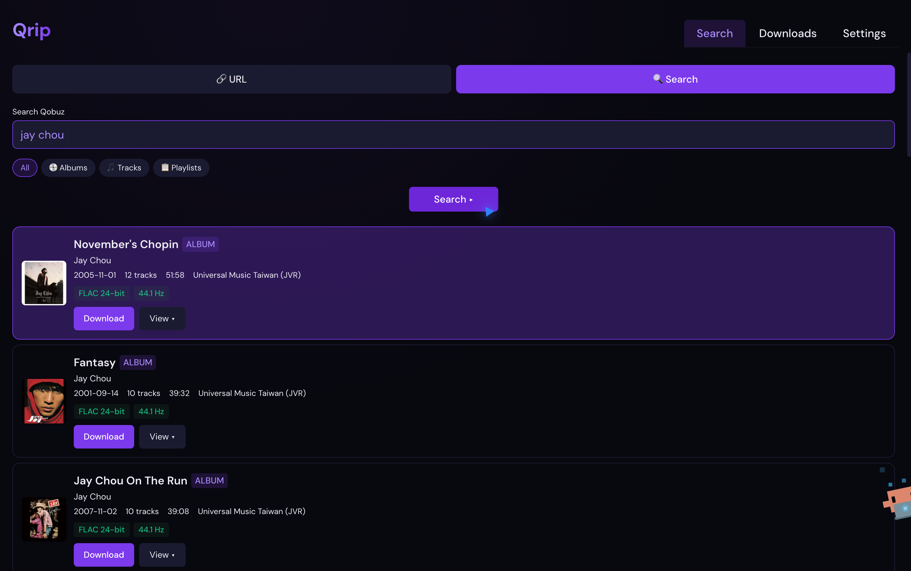

[English](README.md) | **中文**

<div align="center">

# Qrip

**给 streamrip 套上漂亮桌面 GUI 的 Qobuz 高解析度音乐下载器。**


[](https://github.com/zyw0815/Qrip/actions/workflows/build.yml)
[](https://github.com/zyw0815/Qrip/releases)
[](#许可证)

[下载安装](#下载安装) · [功能特性](#功能特性) · [截图](#截图) · [从源码构建](#从源码构建) · [架构](#架构) · [许可证](#许可证) · [免责声明](#免责声明)

</div>

---

## 下载安装

前往 [Releases](https://github.com/zyw0815/Qrip/releases) 页面下载最新版本:

| 平台 | 文件 | 大小 |
| --- | --- | --- |
| Windows | `Qrip Setup 0.1.0.exe` | ~80 MB |
| macOS (Apple 芯片) | `Qrip-0.1.0-arm64.dmg` | ~130 MB |

系统要求:

- Windows 10 或更高版本
- macOS 11.0 或更高版本(Apple 芯片)

> 安装即可运行,无需自行安装 Python——后端已编译成独立二进制内置在应用里。macOS 仅提供 Apple 芯片(arm64)包;Intel Mac 用户请见「[从源码构建](#从源码构建)」。
>
> 安装包目前未签名:macOS 会有「无法验证开发者」提示(右键 → 打开,或在系统设置中允许),Windows SmartScreen 会询问确认。

## 功能特性

- **登录 Qobuz**:应用弹出 Qobuz 登录窗口并自动抓取 auth token——Google、Apple、邮箱等任何登录方式都可以。凭证本地保存、过期前自动复用;每次登录窗口都是全新会话,换账号很方便。也提供粘贴 token 的备用登录方式。
- **搜索浏览**:按关键词搜索专辑 / 曲目 / 歌单,直接展示封面、音质标签(FLAC 位深 / 采样率)、年份、厂牌、时长;结果支持加载更多翻页。
- **粘贴链接**:直接粘贴 Qobuz 曲目 / 专辑 / 歌单链接下载。
- **高解析度下载**:最高 24-bit / 192 kHz FLAC,音质可在设置中调整。
- **专辑曲目列表**:展开专辑查看全部曲目,可单独下载某一首。
- **实时进度**:下载页逐项进度条、速度与队列管理——暂停 / 恢复 / 删除,取消时自动清理半成品文件。
- **无数据库、不去重**:所有内容都可以反复下载,已存在的文件直接覆盖。
- **合理默认值**:文件夹结构 `{artist} — {album} ({year})`,文件名 `{artist} — {title}`,封面内嵌进音频。
- **命名模板**:从预设中挑选,或用 token 自己拼接,带实时预览。
- **封面选项**:内嵌封面,可选单独保存 `cover.jpg`。
- **可扩展设计**:目前只支持 Qobuz,但架构为未来接入更多音源留好了门。

## 截图



## 从源码构建

> 普通用户直接到「[下载安装](#下载安装)」拿打包好的程序即可。本节面向需要自行运行 / 打包源码的用户(例如 Intel Mac)。

需要 Python 3.10+ 和 Node.js 20+。

后端依赖:

```bash
pip install -r python/requirements-build.txt
```

前端依赖:

```bash
npm install
```

开发模式运行(Electron + Vite + FastAPI):

```bash
npm run electron:dev
```

构建后端二进制(PyInstaller,独立可执行,运行时无需 Python):

```bash
npm run build:backend
```

打包应用(electron-builder——在 macOS 上构建 `.dmg`,在 Windows 上构建 `.exe`):

```bash
npm run electron:build
```

产物在 `release/` 目录。

PyInstaller 无法跨平台编译,所以 macOS 的 `.dmg` 必须在 macOS 上构建、Windows 的 `.exe` 必须在 Windows 上构建。若要自动构建,推送一个 `v*` 标签(如 `v0.1.0`)或在 Actions 页面手动触发:GitHub Actions 会产出两个平台的包并挂到 Release。

关于 Intel Mac:arm64 包只能在 Apple 芯片上运行。GitHub 免费的 Intel macOS runner 稀缺且正在退役,因此 CI 不产出 Intel(x86_64)包。如需 Intel 包,请在一台 Intel Mac 上运行 `npm run electron:build` 自行构建(该包在 Apple 芯片上也可经 Rosetta 运行)。

## 架构

Qrip 是三层协作:

```
┌─────────────────────────────────────────┐
│  Electron(桌面外壳)                     │
│  · 窗口与生命周期管理                    │
│  · 以子进程方式启动后端                  │
│  · OAuth 窗口 + token 抓取              │
│  · 系统集成(文件对话框、外部链接)        │
├─────────────────────────────────────────┤
│  React + TypeScript(界面,跑在 Electron 内)│
│  · 登录 / 搜索 / 下载 / 设置             │
│  · 通过 HTTP 与后端通信                 │
├─────────────────────────────────────────┤
│  FastAPI(后端,localhost:8000)           │
│  · 包装 streamrip 核心库                │
│  · auth / search / download / config   │
└─────────────────────────────────────────┘
           ↓ 调用
   streamrip 核心(vendor 在本仓库内)
```

要点:

- **Token 抓取**:OAuth 窗口每次都用全新内存会话创建(不记住任何账号),并通过 `webRequest` 拦截 Qobuz 网页播放器登录后发出的 `X-User-Auth-Token` 请求头。
- **真实进度条**:streamrip 的终端进度条在 GUI 里用不了,Qrip 通过轮询下载文件夹里的文件大小来推算进度与速度。
- **暂停 / 恢复 / 取消**:streamrip 的下载循环是阻塞式同步循环,事件循环无法打断。Qrip 对它做了 monkey-patch——真实传输跑在工作线程里,chunk 回调成为控制点:暂停时让传输线程休眠、恢复时放行、取消时抛异常穿透并干净关闭文件句柄。取消还会清扫半成品文件和空文件夹。
- **串行下载**:一次一首,与 streamrip CLI 的体验一致。

## 许可证

Qrip 以 [GNU General Public License v3.0](LICENSE) 发布。

Qrip vendor 了 [streamrip](https://github.com/nathom/streamrip) 核心库(位于 `streamrip/`),同样是 GPL-3.0 许可证——见 `streamrip/LICENSE`。

## 免责声明

我不对您使用 Qrip 的方式负责。使用 Qrip 即表示您同意 Qobuz API 的条款与条件。
